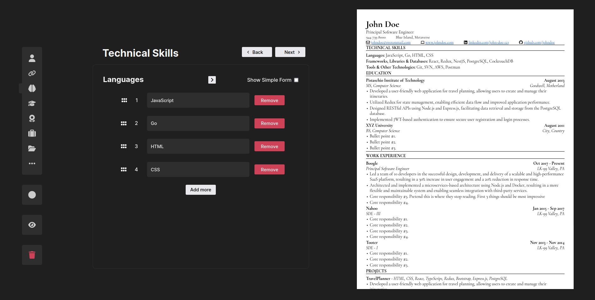

# Code Crafted Resume

A resume builder designed for Developers and Software Engineers.

Do you need a quick and easy resume builder to build a resume which you can actually use(shocking, right?) for applying to a tech job? [CodeCraftedResume.pages.dev](https://codecraftedresume.pages.dev/) to the rescue.

You can drag to reorder form lists and resume sections from the side bar, live preview with side-by-side edit mode and preview & save your application-ready resume PDF with 2 clicks!

The app uses [@react-pdf/renderer](https://react-pdf.org/) to render the pdf on the client so there are no worries of leaking your data. There is no collection or sharing of data involved.

The format of the rendered resume was heavily dependendent on the template provided by Colin at [Sheets & Giggles](https://sheetsgiggles.com/) in one of the top posts on the r/jobs subreddit. If you prefer to create your resume from the original template document, here is the link: [SheetsResume.com](https://sheetsresume.com/resume-template/). It is available as both Word Document and Google Doc.

## Preview

## Features to be added

These are the features that I wanted to implement but did not prioritise due to the time constraint that I set for myself. I will be adding them one-by-one to the app whenever I have time to do so.

- [ ] Add achievements section to the form
- [ ] Fix navigation buttons in place so that button on one side don't change sides when the button on the other side becomes inactive.
- [ ] Modify input placeholders
- [ ] Warnings when recommended inputs are left blank
- [ ] Change skill checkbox to sliding toggle
- [ ] Fix edit mode turning off when a section is deleted
- [ ] Animate
  - [ ] Welcome page unmounting
  - [ ] Live preview mounting
  - [ ] Adding sections in sidbar
  - [ ] Section indicator during navigation
- [ ] Option to add or change accent color (lines and subheadings).
- [ ] Make the app more responsive.
- [ ] Improve PDF rendering efficiency.
- [ ] Option to align resume header(name, title, links, etc) to center.

## What I learned

While doing this project, I learned:
- React Fundamentals
- Creating a react app with Create React App
  - Learned other better ways for this as well, like through Vite or Next.js
  - But decided to go ahead with CRA since The Odin Project recommended CRA when I started the project for learning purposes
  - It probably is still fine for learning
- Class components and lifecycle methods
- Function components and Hooks
- Migrating from class components to function components
  - and replacing lifecycle methods with equivalent hooks like useEffect
- Controlling inputs and rendering lists in react
- Managing state in react
- Using external libraries like Zustand, react-pdf & dndkit
  - Zustand for global state management
  - react-pdf for pdf generation
  - dndkit for sortable drag 'n' drop lists
- Deploying a site with a PaaS like Cloudflare Pages.

This project was bootstrapped with [Create React App](https://github.com/facebook/create-react-app).